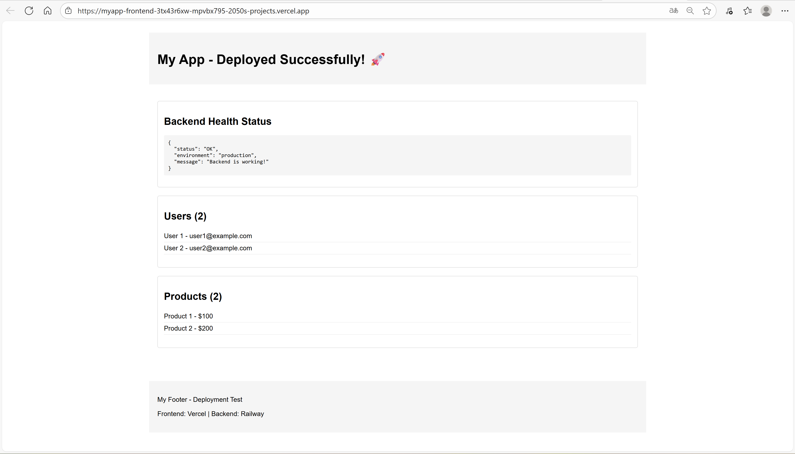

# Практическая работа №25: Деплой приложения

## Ссылки на задеплоенные приложения:
1. **Frontend URL**: https://myapp-frontend-3tx43r6xw-mpvbx795-2050s-projects.vercel.app
2. **Backend URL**: https://myapp-backend-production-d618.up.railway.app

## Описание процесса деплоя

### Используемые платформы:
- **Frontend**: Vercel
- **Backend**: Railway

### Процесс деплоя:

#### Подготовка бэкенда:
1. Создана production-конфигурация в `backend/.env`
2. Настроены environment variables для production
3. Добавлены необходимые API endpoints
4. Настроен CORS для фронтенда

#### Подготовка фронтенда:
1. Созданы React компоненты для отображения данных
2. Настроен `.env.production` с URL бэкенда
3. Созданы конфигурационные файлы для деплоя

#### Деплой:
1. **Бэкенд** задеплоен на Railway с помощью `railway up`
2. **Фронтенд** задеплоен на Vercel с помощью `vercel --prod`
3. Настроена интеграция между фронтендом и бэкендом

## Скриншоты работающего приложения

## Проблемы и их решение

### Проблема 1: CORS ошибки
**Симптомы**: Frontend показывал "Error :(" и "Failed to fetch"
**Решение**: Обновление переменной `CORS_ORIGIN` в Railway на актуальный URL фронтенда

### Проблема 2: Отсутствующие endpoints в бэкенде
**Симптомы**: 404 ошибки при обращении к `/api/users` и `/api/products`
**Решение**: Добавление недостающих endpoints в `server.js`

### Проблема 3: Смена URL фронтенда после передеплоя
**Симптомы**: Приложение перестало работать после обновления фронтенда
**Решение**: Обновление `CORS_ORIGIN` при каждом изменении URL фронтенда
