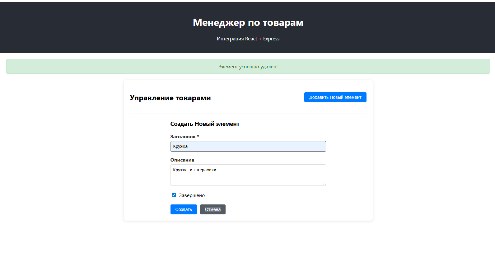
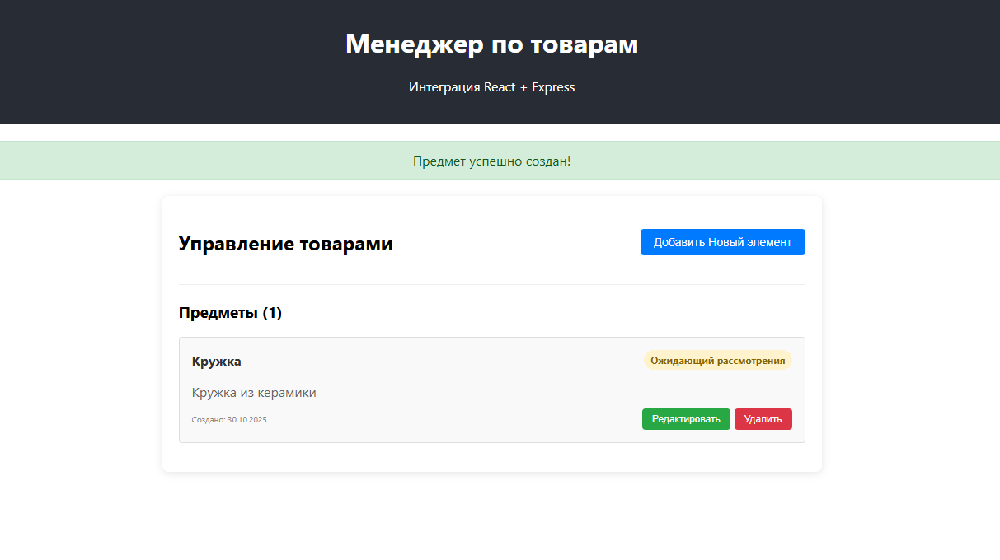
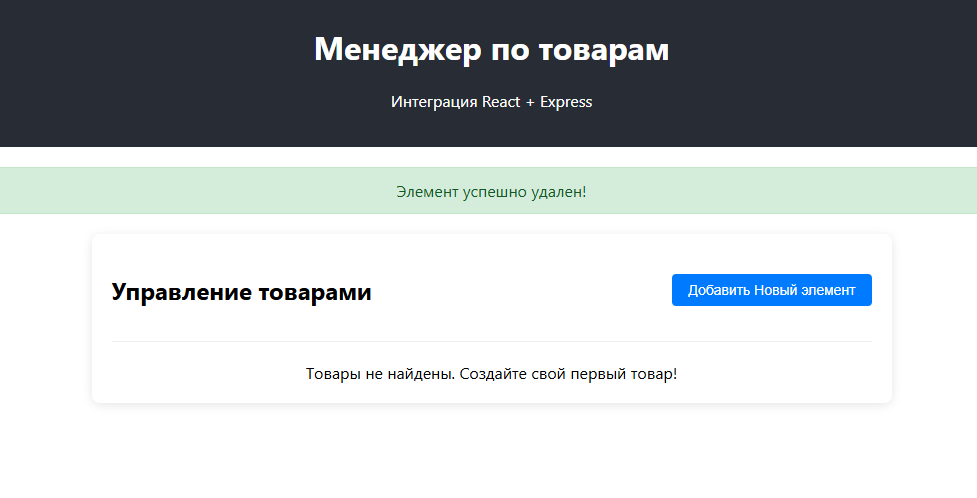

# Документация проекта

## Инструкции по запуску

### Запуск бэкенда (Express сервер)

```bash
# Переход в папку бэкенда
cd backend

# Установка зависимостей (если не установлены)
npm install

# Запуск сервера
npm start
```

Сервер запустится на порту 5000: http://localhost:5000

### Запуск фронтенда (React приложение)

```bash
# Переход в папку фронтенда (в отдельном терминале)
cd frontend

# Установка зависимостей (если не установлены)
npm install

# Запуск приложения
npm start
```

Приложение запустится на порту 3000: http://localhost:3000

## Описание API Endpoints

### Базовый URL
```
http://localhost:5000/api
```

### Endpoints для работы с Items

#### 1. GET /api/items
**Получение всех items**

**Response:**
```json
{
  "success": true,
  "data": [
    {
      "id": 1,
      "title": "Example Item",
      "description": "Item description",
      "completed": false,
      "createdAt": "2024-01-15T10:30:00.000Z"
    }
  ],
  "count": 1
}
```

#### 2. GET /api/items/:id
**Получение конкретного item по ID**

**Response:**
```json
{
  "success": true,
  "data": {
    "id": 1,
    "title": "Example Item",
    "description": "Item description",
    "completed": false,
    "createdAt": "2024-01-15T10:30:00.000Z"
  }
}
```

#### 3. POST /api/items
**Создание нового item**

**Body:**
```json
{
  "title": "New Item",
  "description": "Optional description",
  "completed": false
}
```

**Response:**
```json
{
  "success": true,
  "data": {
    "id": 2,
    "title": "New Item",
    "description": "Optional description",
    "completed": false,
    "createdAt": "2024-01-15T10:35:00.000Z"
  }
}
```

#### 4. PUT /api/items/:id
**Обновление item**

**Body:**
```json
{
  "title": "Updated Item",
  "description": "Updated description",
  "completed": true
}
```

**Response:**
```json
{
  "success": true,
  "data": {
    "id": 1,
    "title": "Updated Item",
    "description": "Updated description",
    "completed": true,
    "createdAt": "2024-01-15T10:30:00.000Z"
  }
}
```

#### 5. DELETE /api/items/:id
**Удаление item**

**Response:**
```json
{
  "success": true,
  "message": "Item deleted successfully"
}
```

### Модель данных Item

```javascript
{
  id: number,           // Уникальный идентификатор
  title: string,        // Заголовок (обязательное поле)
  description: string,  // Описание (опционально)
  completed: boolean,   // Статус выполнения
  createdAt: string     // Дата создания (ISO строка)
}
```

### Коды ответов

- `200` - Успешный запрос
- `201` - Успешное создание
- `400` - Неверные данные
- `404` - Ресурс не найден
- `500` - Ошибка сервера