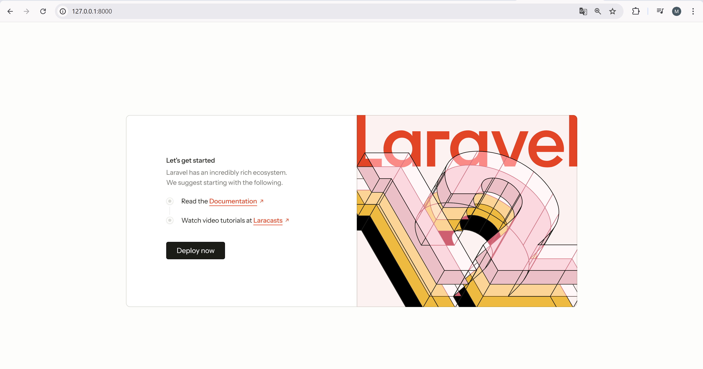
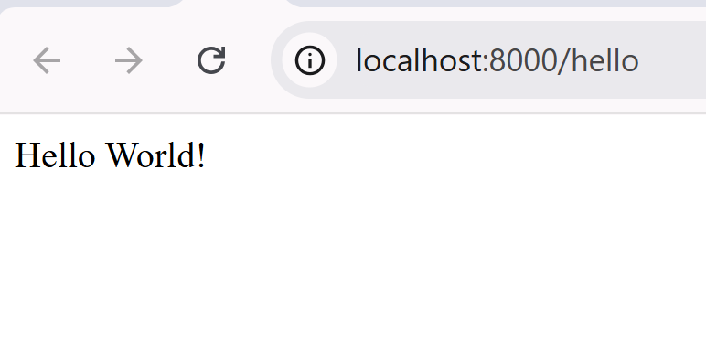
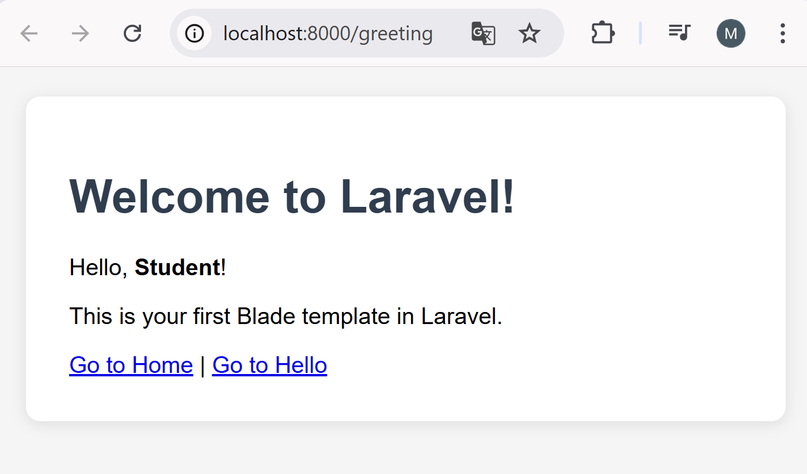
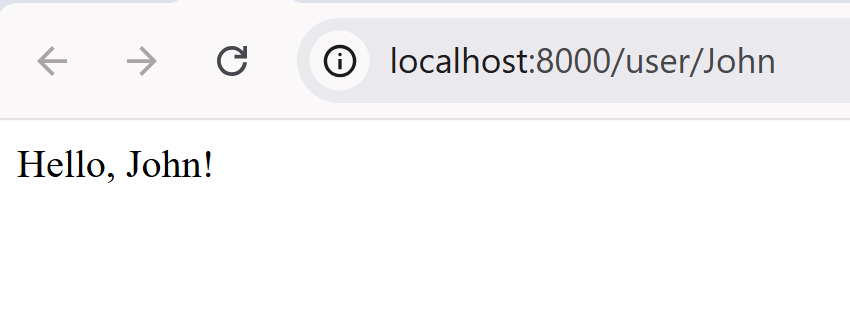
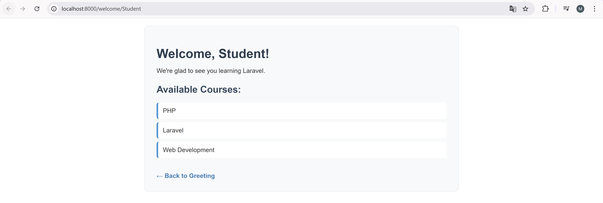

# Практическая работа №26: Анализ PHP и знакомство с Laravel

## Описание проекта
Этот проект демонстрирует анализ legacy PHP-кода и создание современного приложения на Laravel.

## Выявленные проблемы в legacy-коде

### 1. Смешение логики и представления
- HTML и PHP код перемешаны, что усложняет поддержку
- Отсутствует разделение ответственности
- Прямой вывод через echo и print

### 2. Угрозы безопасности
- SQL-инъекции через прямое использование `$_GET` и `$_POST`
- Отсутствие валидации входных данных
- Потенциальные XSS-атаки

### 3. Архитектурные проблемы
- Процедурный стиль вместо ООП
- Отсутствие обработки ошибок
- Прямые SQL-запросы вместо ORM

## Инструкции по установке и запуску проекта

### Требования
- PHP 8.0 или выше
- Composer
- Git

### Установка
```bash
# Клонирование репозитория
git clone <your-repository-url>
cd pr26-project

# Установка зависимостей Laravel
cd laravel-app
composer install

# Запуск сервера разработки
php artisan serve
```

### Доступ к приложению
Откройте браузер и перейдите по адресу: `http://localhost:8000`

## Описание созданных маршрутов и шаблонов

### Маршруты:
1. `GET /` - Главная страница Laravel
2. `GET /hello` - Простой текст "Hello World!"
3. `GET /user/{name}` - Приветствие с именем
4. `GET /greeting` - Blade шаблон с передачей данных
5. `GET /welcome/{name?}` - Расширенный шаблон с массивом данных

### Шаблоны:
1. **greeting.blade.php** - Простой шаблон с приветствием
2. **welcome-user.blade.php** - Шаблон со списком курсов и стилизацией

## Скриншоты работающего приложения

### 1. Главная страница Laravel


### 2. Простой маршрут /hello


### 3. Blade шаблон /greeting  


### 4. Динамический маршрут /user/John


### 5. Расширенный шаблон /welcome/Student
